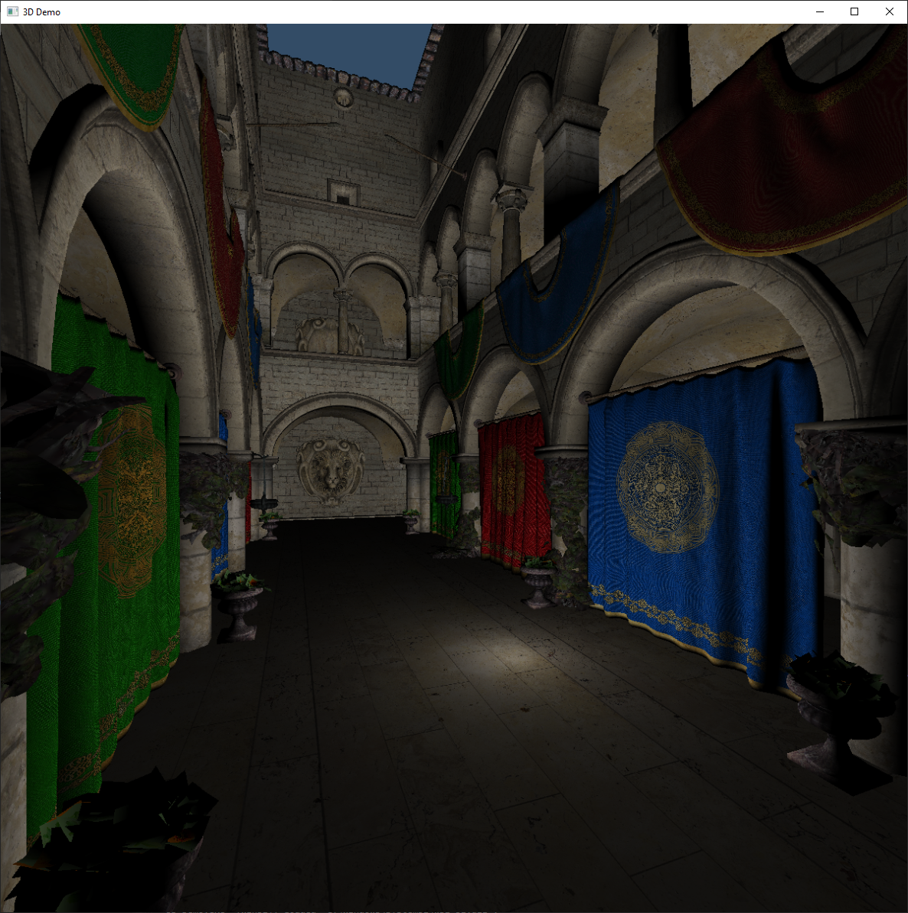

# 3D-Demo

* A 3D renderer using Direct3D 11.
* Uses a custom OBJ and MTL parser.
  * Meshes are deviced to sub-meshes to use multiple materials in specific regions of a mesh.
  * All sub-meshes use the same vertex buffer and index buffer, but have unique offsets in the index buffer. 
